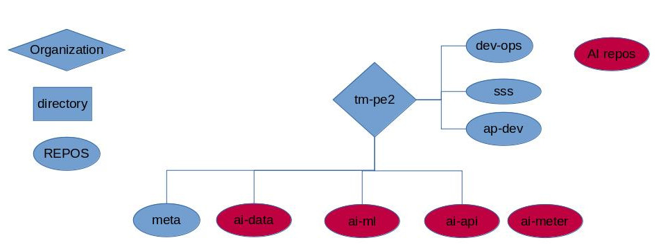

# ai-data
Data preparation

## Objective
  The main objective of this repository is to prepare data to be used in the repo **tm-pe2/ai-ml** whose objective is to evaluate our current data using different machine learning algorithms. Then in the directory **tm-pe2/ai-data/synthetic** one would implement the model to generate synthetic data and finally in the directory **tm-pe2/ai-data/exploration** one could do bussiness analysis of the data. More specifically this repo will contain three directories which would have slightly different objectives:
  1. Directory **tm-pe2/ai-data/real**
    - Here the the different data source would be listed and described.
    - Cleansing of the data using a consistent method (for example droping rows with NaN values).
    - Enriching the data by using the algorithm from **tm-pe2/ai-data/synthetic**.
    - Describe in a file *description.txt(md)* the libraries and methods used to achieve the above.
  3. Directory **tm-pe2/ai-data/synthetic**
    - Definition, description and justification of the model(s) to be used to generate synthetic data.
    - Enrich the real data using the synthetic data.
    - Describe in a file *description.txt(md)* the libraries and methods used to achieve the above.
  4. Directory **tm-pe2/ai-data/exploration**
    - Data normalization.
    - Visualization of the data.
    - Gain a broad understanding and proposed which variables have the most impact on the business decision making.
    - Split the data into three categories: 
      - Training set (80%)
      - Cross-validation set (10%)
      - Test set (10%)
    - Describe in a file *description.txt(md)* the libraries and methods used to achieve the above.

The above are just starting guidelines that can be adjusted and modified as we need.

## Directory Tree Proposal
  
